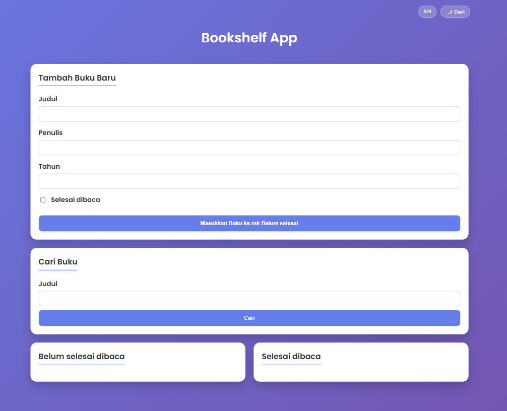
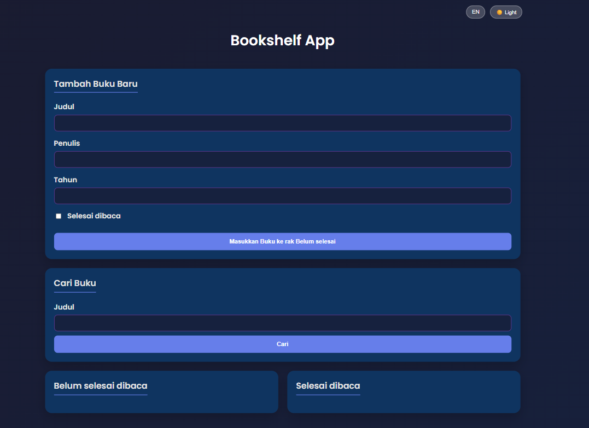

# 📚 Bookshelf App - Personal Library Manager

Aplikasi pengelolaan daftar buku berbasis web yang dikembangkan sebagai proyek akhir kelas **"Belajar Membuat Front-End Web untuk Pemula"** di Dicoding Indonesia. Proyek ini telah diverifikasi dan mendapatkan penilaian **Bintang 5 (Sempurna)** ⭐.

## 📸 Tampilan Aplikasi (LIGHT MODE)

## 📸 Tampilan Aplikasi (DARK MODE)

## 🔗 Tautan Proyek
* **Live Demo**: [https://mahmuda1004.github.io/bookshelf-app-dicoding/](https://mahmuda1004.github.io/bookshelf-app/)
* **Repositori**: [https://github.com/mahmuda1004/bookshelf-app-dicoding](https://github.com/mahmuda1004/bookshelf-app)

## 📖 Penjelasan Proyek
Aplikasi ini dirancang untuk membantu pengguna mengelola koleksi buku secara digital dengan fitur pemisahan rak antara buku yang sedang dibaca dan yang sudah selesai dibaca. Fokus utama pengembangan ini adalah pada manipulasi **DOM (Document Object Model)** dan penggunaan **Web Storage**.

### Fitur Unggulan:
* **Persistensi Data**: Menggunakan `localStorage` sehingga data buku tetap tersimpan meskipun browser ditutup atau halaman dimuat ulang.
* **Antarmuka Modern**: Dilengkapi dengan fitur **Dark Mode** untuk kenyamanan visual pengguna.
* **Aksesibilitas**: Mendukung fitur **Multi-bahasa** (Bahasa Indonesia & Inggris).
* **Pencarian Cepat**: Fitur filter buku berdasarkan judul secara *real-time*.

## 🛠️ Detail Teknis & Kriteria
Proyek ini memenuhi standar teknis industri dan kriteria ketat dari Dicoding, termasuk:
1.  **Struktur Data**: Setiap buku memiliki ID unik berbasis *timestamp*.
2.  **Kepatuhan Atribut**: Menggunakan atribut `data-testid` secara konsisten pada elemen judul, penulis, tahun, dan tombol aksi untuk keperluan pengujian otomatis (*automated testing*) sesuai standar Dicoding.
3.  **Interaktivitas**: Fungsi tambah, hapus, pindah rak, dan edit buku berjalan secara responsif.

## 👤 Profil Pengembang
* **Nama**: Mahmuda
* **Pendidikan**: S1 Informatika, Universitas Mulawarman (Lulus 2024)
* **Keahlian**: Web Development (HTML, CSS, JavaScript, PHP), Python, Data Engineering
* **Domisili**: Penajam Paser Utara, Kalimantan Timur

---
*Proyek ini dikembangkan dengan penuh ketelitian untuk memastikan kualitas kode dan pengalaman pengguna yang optimal.*
